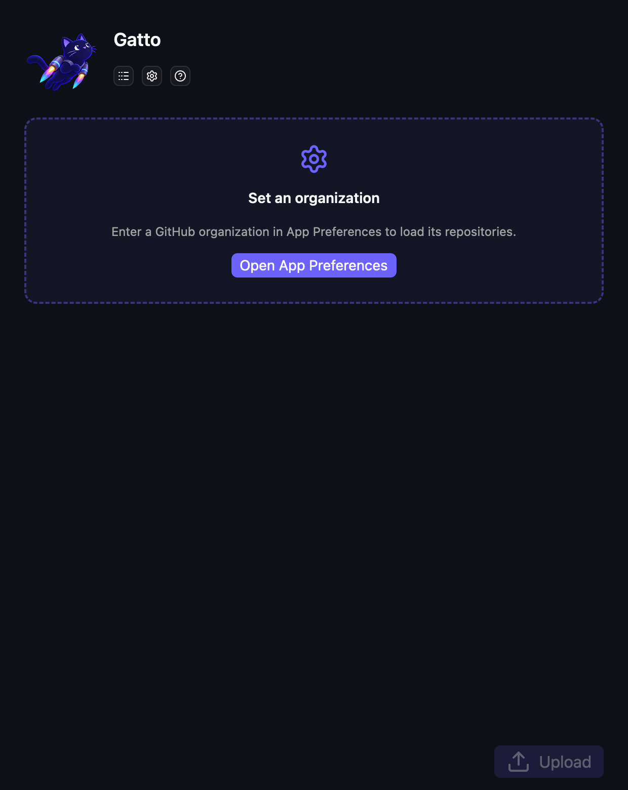
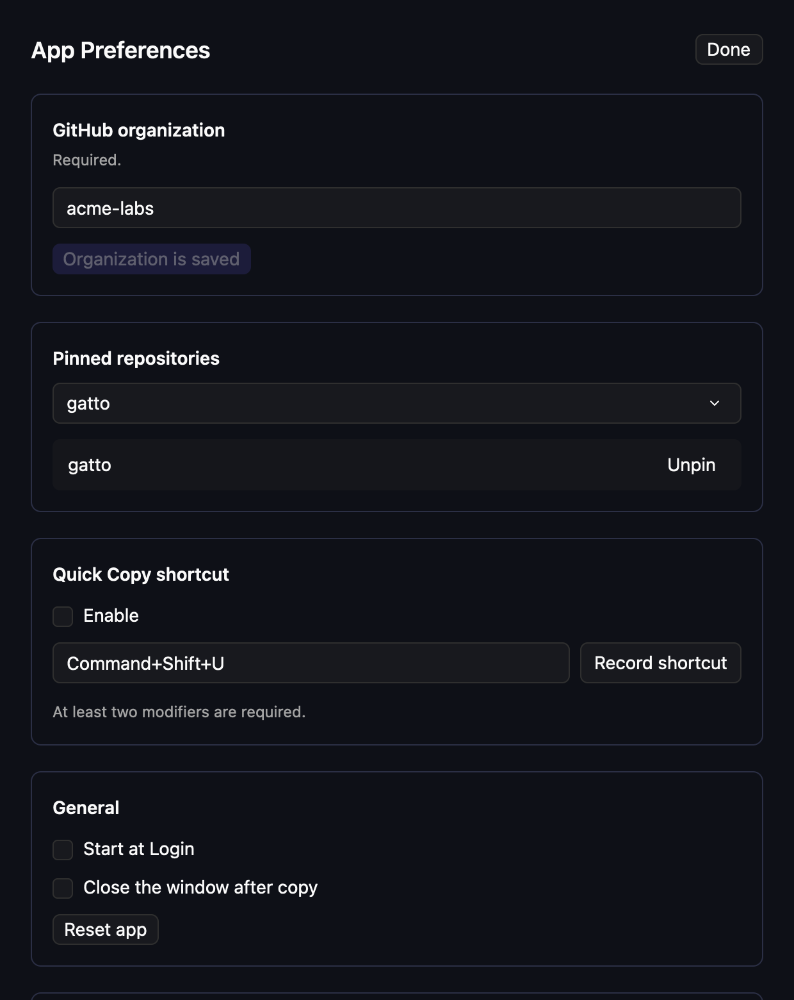
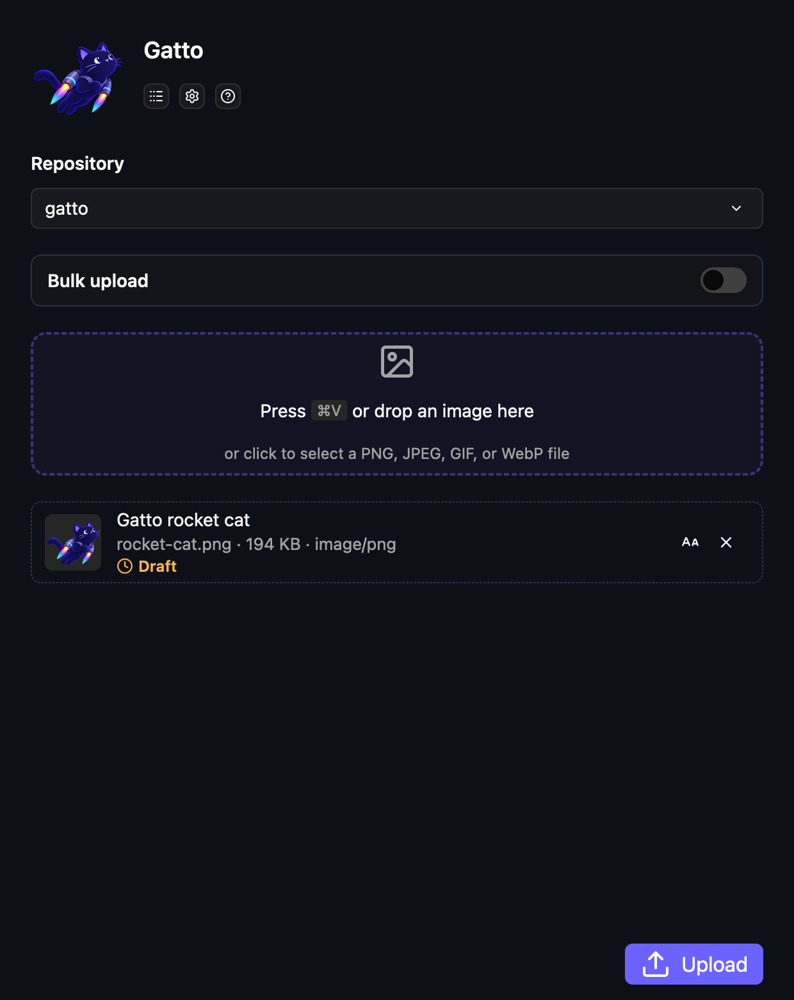
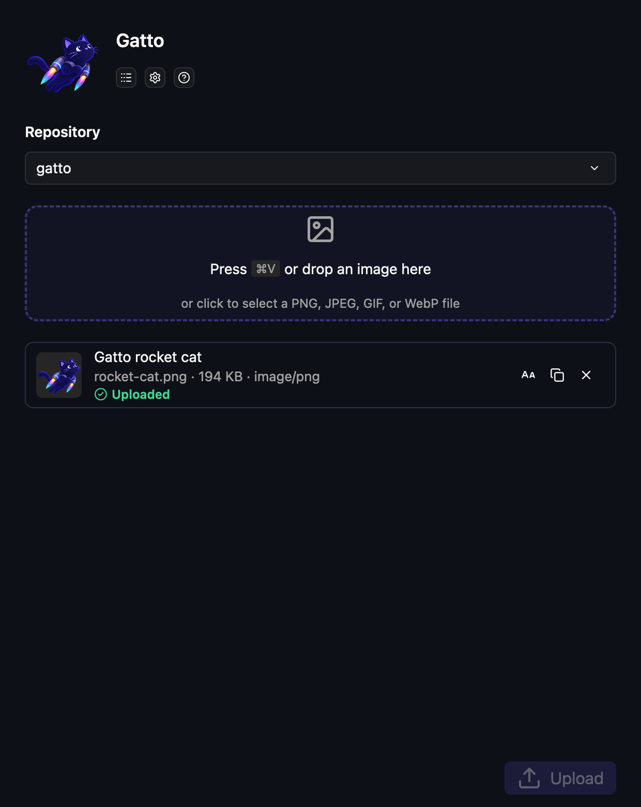

# Gatto walkthrough

Gatto turns a local image into GitHub-ready Markdown. This walkthrough covers setup, normal and
background uploads, keyboard shortcuts, and the `gatto://` automation scheme.

## 1. Set up the app

The first-run screen points you to App Preferences. Gatto will not contact GitHub until an organization has been configured.



Open **App Preferences** using the settings icon, enter the GitHub organization whose repositories
you want to use, and save it. Gatto uses the active GitHub CLI account. If GitHub CLI is not yet
installed, follow its [installation instructions](https://cli.github.com/), then run `gh auth login`
and sign in to an account that can access the organization. The logs icon opens Application Logs,
and the question-mark icon opens this walkthrough in your default browser.

## 2. Choose a repository

Select the repository that should own the uploaded attachment. Pin repositories you use regularly to keep them at the top of the picker and enable the menu bar's clipboard shortcuts.



Settings are stored locally. GitHub authentication remains managed by GitHub CLI. App Preferences
also contains Start at Login, the optional global Quick Copy shortcut, and **Close the window after
copy**.

## 3. Stage an image

Return to the main window and paste an image, drag an image into the drop zone, or click the drop zone to select a file. PNG, JPEG, GIF, and WebP images are supported.



The attachment stays in Gatto while it uploads. You can edit its description, remove it, or preview it before sending.

## 4. Upload and copy the Markdown

Click **Upload**. After GitHub accepts the attachment, its status changes to **Uploaded** and the attachment gains a copy button.



Copy the generated Markdown and paste it into a GitHub issue, pull request, discussion, or Markdown file. The result has this form:

```md

```

## Faster clipboard uploads

After pinning a repository, copy an image and use one of these actions from Gatto's menu bar icon:

- **Preview from Clipboard** stages the image in the main window.
- **Quick Copy** uploads it in the background, copies its Markdown, and sends a macOS notification when it finishes.

You can also enable and customize a global Quick Copy keyboard shortcut in App Preferences. Click
**Record shortcut**, then press the chord you want to use. The shortcut must contain at least two
modifier keys.

When multiple repositories are pinned, Quick Copy uses the most recently selected pinned
repository, falling back to the alphabetically first pinned repository.

## Keyboard copy actions

After at least one upload succeeds, the uploader supports these keyboard actions:

- **Command+Shift+C** copies every uploaded URL, separated by newlines.
- **Command+Shift+M** copies every uploaded Markdown image snippet, separated by newlines.

These shortcuts act on completed uploads in the open window. The optional global Quick Copy
shortcut is different: it reads a new image from the clipboard and performs a background upload.

## Automate Gatto with custom URLs

The packaged app registers the `gatto` custom URL scheme with macOS. Shortcuts, shell scripts,
launchers, browsers, and other automation tools can invoke the same actions as Gatto's interface:

| URL | Action |
| --- | --- |
| `gatto://open` | Show and activate the main Gatto window. |
| `gatto://preview` | Show the main window and stage the current clipboard image. |
| `gatto://quick-copy` | Upload the clipboard image in the background, copy its Markdown, and notify when finished. |
| `gatto://settings` | Show Gatto and open App Preferences. |

From Terminal, use macOS's `open` command:

```sh
open "gatto://quick-copy"
```

Quick Copy requires a configured organization and at least one pinned repository. Gatto chooses
the preferred pinned repository using the same rules as the menu bar and global keyboard shortcut.
Action URLs intentionally accept no query parameters, fragments, repository names, or additional
path components; repository selection remains controlled by App Preferences.

## Updating these screenshots

From the repository root, run:

```sh
./scripts/update-walkthrough-screenshots.sh
```

The script renders the production GPUI interface through its off-screen Metal renderer using fixed, in-memory example data. It does not read or modify Gatto preferences, contact GitHub, use UI automation, or require Screen Recording permission. The command is macOS-only and overwrites the PNG files under `docs/images/walkthrough/`.
